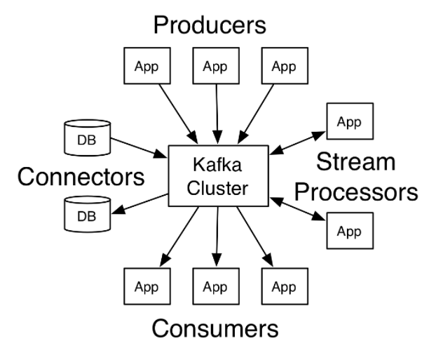

# Kafka 101: What is Kafka
Apache Kafka, a *distributed streaming platform* is widely used for real-time processing of stream data.  
Based on a **Producer-Consumer** model, Kafka enables real-time streaming data pipelines between servers. As can be known by its description *'distributed streaming platform'*, Kafka runs as a cluster of several servers, each server serving as a datacenter.  
  
## Basic concepts of Kafka structure
### Broker
Servers or nodes in Kafka application.
  
### Producer 
publishes a stream of records to one or more topics in brokers. 
  
### Consumer 
retrieves and processes topics with stream of records, from brokers. 

### Streams 
Stream processor which transforms the input streams to output streams.

### Connector 
connects Producers, topics, and Consumers to applications or data systems, making them resuable. 

  
  
### Topics
Topic is the core abstraction for stream of records. Each record, consisting of a key, value, and a timestamp, is published to a topic; where one or more consumers subscribe to the data written on it.  
Each topic has a corresponding log, each log partitioned to an ordered, immutable sequence of records. Each record in each partition gets a sequential id(*a.k.a. offset*) assigned.  
Having partitions make Kafka more scalable. Although a single partition should fit in a single server, since each topic(log) can have multiple partitions, the actual scale goes beyond the capacity of a single server. 
All published records are preserved for a configurable retention period.     
  
## Reference
[Apache Kafka tutorial](https://kafka.apache.org/intro)
