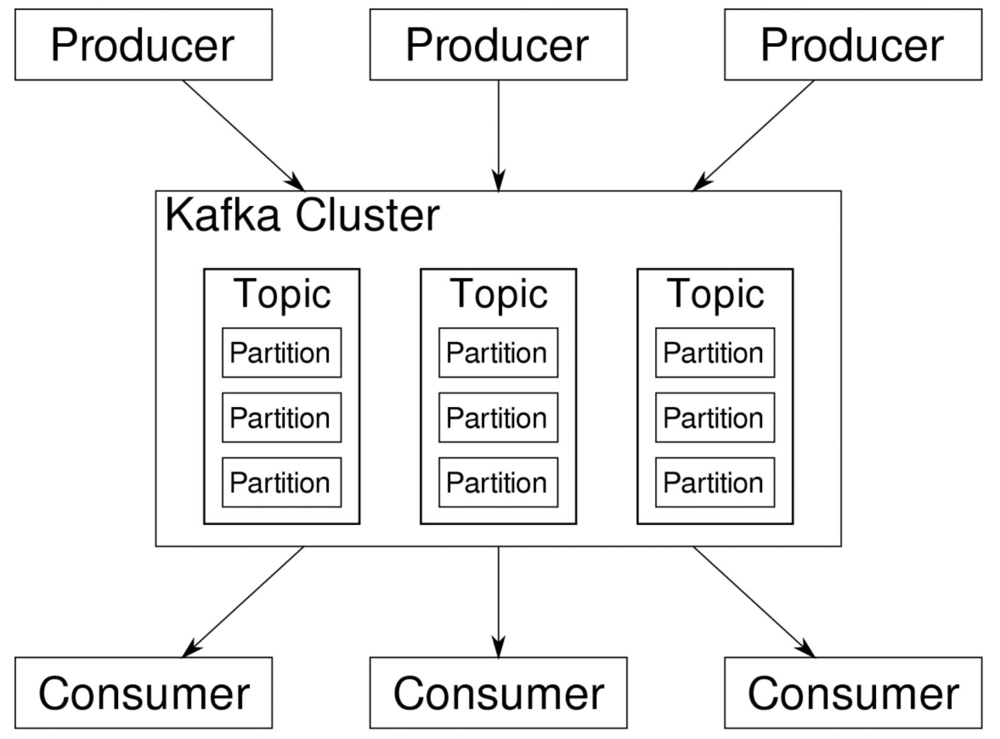
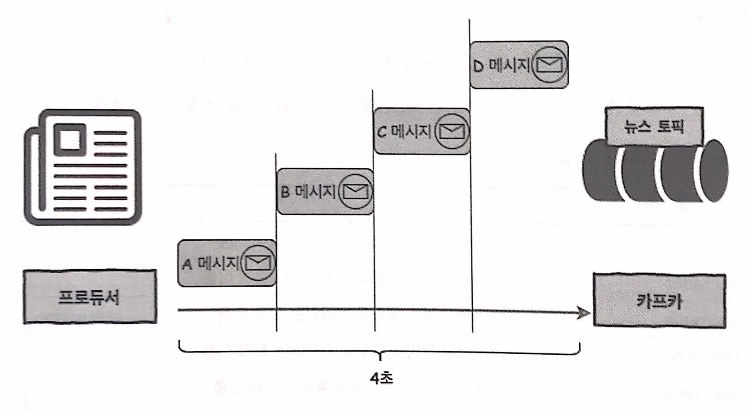
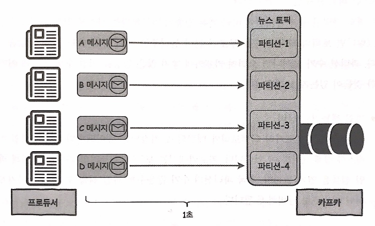
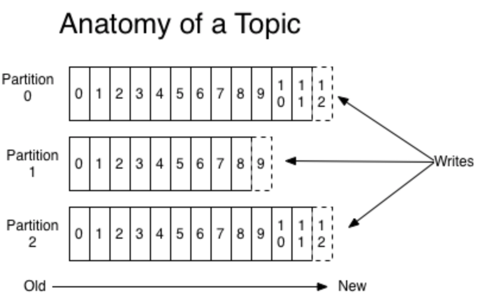

# The Design of Kafka Structure
Handling large scale real-time data in a stable manner is indeed a demanding job.  
In this section, we will go through the design of Kafka, mainly focusing on how it successfully manages to do such a demanding job.  
  
Core concepts are:
- Distributed System
- Batch Transmission
- Partition
- Replication
  
1. Distributed System
is a group of servers running for the same purpose. By distributing a job to multiple servers, we expect to:  
    - have better performance,
    - have stable system as servers can backup each other in case of error,
    - have system expansion easier.  
Kafka is designed to be a distributed system, each set of servers being called as 'cluster'.
  
2. Page Cache
Kafka is designed to refer to OS page cache in order to fasten up the processing time. 

3. Batch Transmission
Kafka is designed to support batch transmission, reducing I/O overhead. Producer sends multiple messages to Kafka server in a batch.
  
## Data Model of Kafka
Data model in Kafka is composed of `topic` and `partition`. This two dimensional model plays a key role in high-performance & high-availability of Kafka system.     

image from [here](https://linuxhint.com/apache_kafka_partitions/)
  
### Topic
is where a Kafka cluster stores data. Topic is somehow analogous to email address in a sense that it can be used as a key for classifying and organizing data. While there is no explicit rule of naming topics, it is recommended to have appropriate prefix to avoid confusion.
  
### Partition
breaks down each topic in a way that supports parallel data processing. With a single topic, producers and their messages should wait in a queue to maintain the order, casuing significant time consumption. Having multiple partitions for a single topic let each producer send their message concurrently, without worrying the original order of messages as long as the order of partitions is well established. Note that parallel processing is available only with proper number of both **partitions and producers**.  
Below is a visualized version of parallel mechanism with partitions.  
*Single producer with no partition:*

  
*Multiple producers with partitions:*

  
Then now we wonder, *how many* partitions is 'appropriate'?  
Increasing the number of partitions per topic does expedite data transmission. However having too many partitions is not always a cure-all.  
It may:  
1. Waste file handler.  
Each partition is mapped to the directory of broker, storing two files per a datum: one for the datum itself, the other for its index. Kafka opens up new file handler for every single file in the directories.
  
2. Recovery gets more difficult.  
Kafka creates replications for each partition: original partition becomes a leader, the rest become followers. Each broker contains several topics, and each topic is divided up into several partitions, in the way of multiple partitions(replications) sharing a single broker. If a broker went down, partitions with its leader at the broken broker would need a new leader, and the time consumption for selecting new leader is proportional to the number of partitions. 
  
While it is easy to increase the number of partitions, Kafka does not support decreasing the number of partitions. The only way to get this through is to delete the topic and recreate the topic with adjusted number of partitions. 
  
It is mentioned above that the concept of partitioning was first originated to fasten up message transmission *without scrambling the order* of messages. Then how do we preserve the order within each partition?  
The answer here is `offset`.  
**Offset** is the unique ascending 64-bit integer that refers to the location of each message within the partition. Note that the offset is unique only within each partition, thus it is always necessary to pair up the partion and the offset to retrieve desired data(message). As just stated, offset is created in ascending order, and only accessible in that order.      


## Replication in Kafka
Kafka replicates `partitions` to implement stable distributed system. The original partition is called **leader** and replications are called **followers**. 
  
### Replication Factor 
indicates the number of replicas to create. The default value is set to be 1, but configuring replication factor can be done anytime even while it'r running.  
  
```sh
vi /usr/local/kafka/config/server.properties  
```
Append below line:  
```sh
default.replication.factor = {replication_factor}
```
  
It is also available to set different replication factors for different topics, but make sure to have same replication factor for all the brokers in the cluster.
  
### Leader and Followers
Note that only **leader** can perform read and write actions. Followers do not perform any action for now, but constantly fetch data from leader to be ready to replace the leader when current leader goes down. Having followers as backup, Kafka implements stable data transmission regardless of server fault. 
  
* __In Sync Replica(ISR)__ is a group of replications. Only the followers within same ISR can replace the leader, thereby guaranteeing consistency. Leader periodically checks if followers are up-to-date, and kick out the ones that fell behind.
  
However, what if all the brokers went down? There can be two possible options:  
1. Wait until the last leader revives.  
    - prioritizes data integrity.
2. Let any follower that revives first become new leader, even if it is outside of ISR.  
    - prioritizes fast recovery.
Option 2 was a default setting before Kafka version 0.11.0.0, but since 0.11.0.0 option 1 is set to be dafault. It is also possible to change the setting by:  
```sh
vi /usr/local/kafka/config/server.properties  
```
Set as below:  
```sh
unclean.leader.election.enable = true  
```
Setting `unclean.leader.election.enable` to `true` corresponds to option 2, `false` corresponds to option 1.
  

## Reference
[Apache Kafka Documentation](http://kafka.apache.org/081/documentation.html)  
[Book: 카프카, 데이터 플랫폼의 최강자](https://github.com/onlybooks/kafka/)

