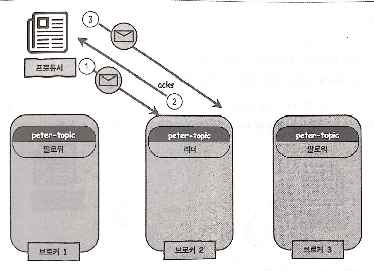

# Producer in Kafka
Kafka producer refers to all the servers and applications that produce and send messages to Kafka topics. Producers in Kafka map each message to topic partition, and send request to the leader of the partition. Kafka producer can set particular key and send all the messages with that key to the same partition. If no key set, then messages are sent to partitions in round-robin.
  
Note that topics should be present in order to send messages. Setting property as `auto.create.topics.enable = true` will automatically create topic if nothing exists.
  
## Sending Messages with Console
First, create a topic.  
```sh
/usr/local/kafka/bin/kafka-topics.sh \
--zookeeper esther-zk001:2181,esther-zk002:2181,esther-zk003:2181/esther-kafka \
--topic esther-topic --partitions 1 --replication-factor 3 --create
```
  
Check topic information.
```sh
/usr/local/kafka/bin/kafka-topics.sh \
--zookeeper esther-zk001:2181/esther-kafka --topic esther-topic --describe
```
  
Initiate console prompt.
```sh
/usr/local/kafka/bin/kafka-console-producer.sh \
--broker-list esther;kafka001:9092,esther-kafka002:9092,esther-kafka003:9092 \
--topic esther-topic
```
  
## Sending Messages with kafka-python
```python
from kafka import KafkaProducer

# assign a list of brokers to `bootstrap.servers`
producer = KafkaProducer(acks = 1, compresion_type = 'gzip', \
                         bootstrap_servers = \
                         'esther-kafka001:9092,esther-kafka002:9092,esther-kafka003:9092')

# send message to designated topic
producer.send('esther-topic', 'Hello Kafka')
```
Note that it is recommended to list all the kafka clusters to `bootstrap.servers`.
  
## Major Options
1. `bootstrap.servers`  
    is a list of hosts and ports for the initial connection. Every server in Kafka cluster can get requests from clients. It is highly recommended to put all the hosts in the list to provide backup servers. 
2. `acks`  
    is the number of acknowledgements required for message transmission. The smaller the number of acks, the faster it is but higher chance of loosing messages. `acks` can be set in the console command as follows:  
    ```sh
    /usr/local/kafka/bin/kafka-console-producer.sh \
    --broker-list esther-kafka001:9092,esther-kafka002:9092,esther-kafka003:9092 \
    --topic esther-topic --request-required-acks 1
    ```  
3. `buffer.memory`  
    is the number of bytes producer can use as buffer for the message, before sending it to the server.
4. `compression.type`  
    indicates the type of compression producers use to compress messages. `compression.type` can be set in the console command as follows:  
    ```sh
    /usr/local/kafka/bin/kafka-console-producer.sh \
    --broker-list esther-kafka001:9092,esther-kafka002:9092,esther-kafka003:9092 \
    --topic esther-topic --request-required-acks 1
    ```  
5. `retries`  
    is the number of retrials for failed messages.
6. `batch.size`  
    is the maximum batch size byte. 
7. `linger.ms`  
    is a waiting time for batch. Producer sends out batch either if batch size is full or linger time is up.
8. `max.request.size`  
    is the maximum size of message in bytes allowed to send at once.
  
Refer to [official documentation](https://kafka.apache.org/documentation/#producerconfig) for more options.
  
## Measures of Transmitting Messages
### Fast but High Risk Transmission
Producer unilaterally sends out messages without waiting for consumer's response. No acks required. 
  
### Mediocre Transmission
Producer waits for ack response before sending out the next message.  

  
### Slow but Secure Transmission
Setting `acks=1` is still susceptible to errors. In order to guarantee **NO** error at all, Kafka provides `acks=all` which checks acks not only from the leader, but also the followers.
