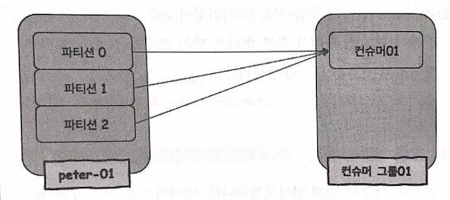
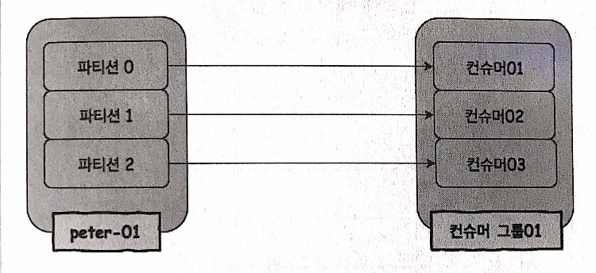

# Consumer in Kafka
Kafka consumer refers to all the servers and applications that retrieve and consume messages from Kafka topics. Consumer sends request to the partition leader with desired offset specified, thereby it can bring in any particular message it wants, or even re-consume the same message again. 
  
There are two types of consumers:  
1. Old Consumer
    Consumers in Kafka versions < 0.9 store offset in Zookeeper Z-node.
2. New Consumer
    Cosumers in Kafka versions >= 0.9 store offset in Kafka topics.
  
Note that this document is written based on new consumer.
  
## Major Options
1. `bootstrap.servers`  
    is a list of host and port information for initial connection. The format should be `host:port,host:port,...`(ex. esther-kafka001:9092,esther-kafka002:9092,esther-kafka003:9092). It is recommended to put the enitre list of hosts and ports in case of break down.
2. `fetch.min.bytes`  
    is the minimum size of data able to fetch for each retrieval. Data will be cumulated until the size is met.
3. `group.id`  
    is an identifier for the *consumer group* this consumer belongs to.
4. `enable.auto.commit`  
    Periodically commit offsets in background.
5. `auto.offset.reset`  
    In case of no existing offset, reset offset as follows:  
        * earliest: set offset as the initial version.
        * latest: set offset as the latest verstion.
        * none: if no previous offset exists, raise an error.
6. `fetch.max.bytes`  
    is the maximum size of data able to fetch for each retrieval.
7. `request.timeout.ms`  
    is the maximum ms to wait for the response.
8. `session.timeout.ms`  
    is a session timeout in ms between consumer and broker. If a consumer did not send **heartbeat** for `session.timeout.ms`, consumer group starts **rebalancing** assuming the consumer is dead. Default duration is 10secs, and is closely related to `heartbeat.interval.ms`. Setting this smaller than the default can detect failure quicker, but may trigger unwanted rebalancing, vice versa. 
9. `heartbeat.interval.ms`  
    decides how frequently the consumers send heartbeat to consumer group coordinator by calling *poll()* method. Should be smaller than `session.timeout.ms`, usually set as 1/3 of it. The default is set to 3secs.
10. `max.poll.records`  
    is the maximum number of records for a single *poll()*.
11. `max.poll.interval.ms`  
    is the maximum interval for calling *poll()*, in order to preclude dummy consumers that send heartbeat but never actually fetch messages. Group coordinator removes the consumers that have exceeded `max.poll.interval.ms` and let other consumers take their partitions.
12. `auto.commit.interval.ms`  
    Periodically commit intervals.
13. `fetch.max.wait.ms`  
    is the waiting upperbound in case of not meeting `fetch.min.bytes`.
  
Refer to [official documentation](https://kafka.apache.org/documentation/#consumerconfigs) for more options.
  
## Retrieving Messages with Console
Retrieve messages from the beginning of the topic.  
```sh
/usr/local/kafka/bin/kafka-console-consumer.sh \
--bootstrap-server esther-kafka001:9092,esther-kafka002:9092,esther-kafka003:9092 \
--topic esther-topic --from-beginning
```
  
Retreive messages with a *consumer group* specified. Kafka automatically creates a consumer group named `console-consumer-xxxxx` when the `--group` option is not specified, with `xxxxx` as integers.  
```sh
/usr/local/kafka/bin/kafka-console-consumer.sh \
--bootstrap-server esther-kafka001:9092,esther-kafka002:9092,esther-kafka003:9092 \
--topic esther-topic --group esther-consumer-group --from-beginning
```
  
Check consumer group.
```sh
/usr/local/kafka/bin/kafka-consumer-groups.sh \
--bootstrap-server esther-kafka001:9092,esther-kafka002:9092,esther-kafka003:9092 \
--list
```
  
## Retrieving Messages with kafka-python
```python
from kafka import KafkaConsumer
  
consumer = KafkaConsumer('esther-topic', group_id = 'esther-consumer', \
                        bootstrap-servers = 'esther-kafka001:9092,esther-kafka002:9092,esther-kafka003:9092', \
                        enable_auto_commit = True, auto_offset_reset = 'latest')
for msg in consumer:
    print("Topic: %s, Parition: %d, Offset: %d, Key: %s, Value: %s" \
          %(msg.topic, msg.partition, msg.offset, msg.key, msg.value.decode('utf-8')))
```
  
## Order of Messages: Partitions
Consumers can only retrieve messages based on the offsets within each partition, therefore never know the overall order of the entire messages sent.  
Message order within the same partition will be abided, but Kafka consumer cannot guarantee the order between partitions. It is also not guaranteed that one paritition is exhausted before consuming the other partition. 
  
*kafka-console-consumer* provides `--partition` option to check the order of messages within same partition. 
```sh
/usr/local/kafka/bin/kafka-console-consumer.sh \
--bootstrap-server esther-kafka001:9092,esther-kafka002:9092,esther-kafka003:9092 \
--topic esther-topic --partition {partition_id} --from-beginning
```
  
The only way to preserve the overall order of the entire messages is to have a **single partition**. However keep in mind that there is a tradeoff between preserving the message order and message processing performance. Having a single partition makes distributed system impossible.
  
## Consumer Group
Kafka manages consumers in a group called consumer group. Consumer group is a group of consumers that retrieve messages from the same topic. By managing meta information(i.e. offsets) of each consumer as a group, it became easier and clearer to expand consumers.  
Different consumer groups can access the same topic simultaneoulsy, thereby utilizing messages with multiple purposes. This possible due to the independency of offset sets between partitions.
  
### Rebalance
In case of producers producing messages faster than consumers consuming messages, more consumers are needed. As new consumers are introduced, the 'ownership' of each consumer for partitions(target partitions to get messages from) should be rearranged. This is called *rebalancing*.  
Each partition is assigned to one consumer, and each consumer may be in charge of more than one partitions. Note that consumers are unable to retrieve messages during the rebalance going on.
  
*Before Rebalance*

  
*After Rebalance*

  
However as each partition is allowed to get only one consumer assigned, there still can be a congestion even after expanding consumer group. This is for the sake of preserving message order within each partition.
  
In a nutshell, expanding consumer group is only efficient up to the point where the number of consumers is equal to the number of partitions. For more expedition, the number of partitions should also be expanded as well as consumers.
  
Rebalance takes place not only when the consumer group is expanded, but also when consumers in the consumer group are dead. If consumers do not send heartbeat(`poll()`) for certain amount of time(`heartbeat.interval.ms`), consumer group either goes through rebalance rightaway or create new consumers then conduct rebalance. 
  
## Commit and Offset
Kafka consumers keep the information of locations of messages retrieved. This locations are called offsets, and updating offsets is called commit.
This information is stored in an independent topic called *__consumer_offsets*. Consumers refer to this topic, get the most recently commited offset, and retrieve messages after that offset.  
If the latest commited offset is
* smaller than actual offset:
    duplicate message will be retrieved.
* bigger than actual offset:
    messages in between will be ommitted.
  
### Auto Commit
By setting `enable.auto.commit=true`, consumers automatically commit the latest offset based on the duration set by `auto.commit.interval.ms`.
  
### Manual Commit
  
### Assigning Particular Parition
Kafka system distributes and assigns partitions to consumers. In case of special needs to assign a particular partition to a particular consumer, extra consumer group is needed only for that particular consumer. Note that it is important to set different consumer group id for such consumer instances.
  
### Retrieving Message from Particular Offset
Kafka consumer API provides manual offset management.
```java
consumer.seek(partition0, 2);
```  
will seek for the message from offset 2 in partitoin0.
  
## Reference
[Book: 카프카, 데이터 플랫폼의 최강자](https://github.com/onlybooks/kafka/)
