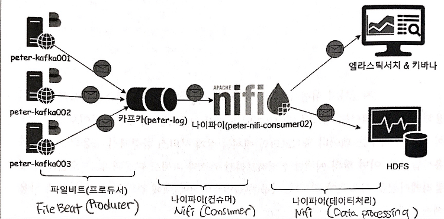

# Data Pipelining with Kafka

  
Following is the list of applications needed for data pipelining with Kafka:  
1. Apache [Nifi](nifi.apache.org)  
2. Elastic [Filebeat](www.elastic.co/products/beats/filebeat)  
3. Elastic [ElasticSearch](www.elastic.co/products/elasticsearch)  
4. Elastic [Kibana](www.elastic.co/products/kibana)
  
## Sending Messages with Filebeat
In Kafka, logs are stored in `/usr/local/kafka/logs/server.log`. Now let's send these logs to Kafka topic.  
  
First, create a topic named *esther-log*.  
```sh
/usr/local/kafka/bin/kafka-topics.sh \
--zookeeper esther-zk001:2181,esther-zk002:2181,esther-zk003:2181/esther-kafka \
--topic esther-log --partitions 3 --replication-factor 2 --create
```
  
### **Filebeat** as Producer
**Filebeat** is an open source, light-weighted data collector. Install Filebeat on Kafka brokers.  
```sh
curl -L -O https://artifacts.elastic.co/downloads/beats/filebeat/filebeat-7.6.1-linux-x86_64.tar.gz
tar xzvf filebeat-7.6.1-linux-x86_64.tar.gz
```
  
Create a configuration file `filebeat.yml` under `/etc/filebeat/`.  
```sh
#=========================== Filebeat prospectors =============================

# Defines which files to send with Filebeat
kafka.home: /usr/local/kafka
filebeat.prospectors:
- input_type: log
  paths:
    - ${kafka.home}/logs/server.log*

  ### Multiline options
  # The regexp Pattern that has to be matched. The example pattern matches all lines starting with [
  multiline.pattern: ^\[

  # Defines if the pattern set under pattern should be negated or not. Default is false.
  multiline.negate: false

  # Match can be set to "after" or "before". It is used to define if lines should be append to a pattern
  # that was (not) matched before or after or as long as a pattern is not matched based on negate.
  # Note: After is the equivalent to previous and before is the equivalent to to next in Logstash
  multiline.match: after

#============================= Filebeat modules ===============================

filebeat.config.modules:
  # Glob pattern for configuration loading
  path: ${path.config}/modules.d/*.yml

  # Set to true to enable config reloading
  reload.enabled: false

#==================== Elasticsearch template setting ==========================

setup.template.settings:
  index.number_of_shards: 3

#==================== KAFKA output ==========================

# Set Filebeat as a Kafka producer
output.kafka:
  hosts: ['esther-kafka001:9092', 'esther-kafka002:9092', 'esther-kafka003:9092']
  topic: 'esther-log'
  partition.round_robin:
    reachable_only: false

  required_acks: 1
  compression: gzip
  max_message_bytes: 1000000
```
  
Start Filebeat with command:  
```sh
systemctl start filebeat.service
```
Check if running fine.
```sh
systemctl status filebeat.service
```
  
Whether filebeats are actually sending messages can be found out by consumers.  
```sh
/usr/local/kafka/bin/kafka-console-consumer.sh \
--bootstrap-server esther-kafka001:9092,esther-kafka002:9092,esther-kafka003:9092 \
--topic esther-log --max-messages 10 --from-beginning
```
  
### **Nifi** as Consumer
**Nifi** is an open source cluster(distributed) application. Install and configure Nifi on all the brokers to create a cluster.
```sh
wget http://apache.mirror.cdnetworks.com/nifi/1.5.0/nifi-1.5.0-bin.tar.gz
tar xzf nifi-1.5.0-bin.tar.gz
ln -s nifi-1.5.0 nifi
```
  
Create a configuration file `nifi.properties` under `/usr/local/nifi/conf`.  
```sh
nifi.web.http.host=esther-kafka001
nifi.cluster.is.node=true
nifi.cluster.node.address=esther-kafka001
nifi.cluster.node.protocol.port=8082
nifi.zookeeper.connect.string=esther-zk001:2181,esther-zk002:2181,esther-zk003:2181
```
  
Run Nifi with the following command:
```sh
cd /usr/local/nifi
bin/nifi.sh install nifi
systemctl start nifi.service
```
  
Check if running fine.
```sh
systemctl status nifi.service
```
  
Connect to web GUI with following url: `http://esther-kafka001:8080/nifi`.
  
### Store Messages in **ElasticSearch**
**Elastic Search** is a distributed RESTful search engine.

## Reference
[Filebeat Official Website](https://www.elastic.co/guide/en/beats/filebeat/current/filebeat-installation.html)
[Elastic Github](https://github.com/elastic/beats/blob/master/filebeat/filebeat.yml)
