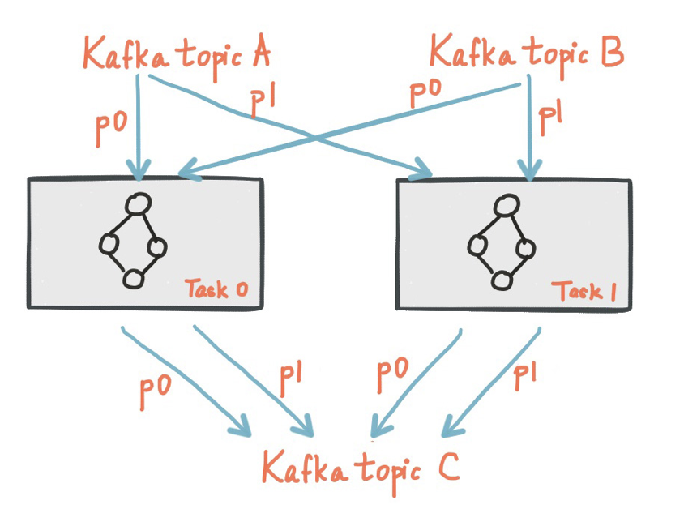

# Kafka Streams API
Kafka provides **Streams** API to process consecutive messages. It enables flexible stream processing in the sense of time distance between *event* and *processing*, by leaving it as an user option.  
  
### Stream vs Batch
**Stream** processing refers to a real-time data processing while continuous data stream keep coming in.  
**Batch** processing(a.k.a data-at-rest) on the other hand stores data for a certain amount(or time), process at a certain point of time.
  
### Stateful vs Stateless
Stream processing applications may store *past* data for future analysis. This is called **stateful**, meaning that past states do have effects on current states. Extra **state stores** are needed in this case, either managed by the application itselt(called *internal state store*) or by *external* database.  
**Stateless** processing in the meantime, process data only based on the current stream regardless of the past analysis.
  
## Kafka Streams
is a *topology* based API:

- Stream:  
    Stream is a topology created by Kafka Streams API, representing a set of data continuously being streamed. Data records are stored as `key-value` form in the stream.
- Stream Application:  
    Application that makes use of Kafka Stream Client, meaning a *logic* deployed in the processor topology.
- Stream Processor:  
    is a node in the processor topology. Each node receives data records from its parent node, process, then convey them to its child node.
- Source Processor:  
    The uppermost processors with no other processor attached above. These processors read data records from Kafka topics and stream down to below processors.
- Sink Processor:  
    The lowermost processors with no other processors attached below. These processors store data records in Kafka topics.
  
### Kafka Streams Architecture
Data stream can be considered as Kafka topic. Each stream partition corresponds to the ordered messages in Kafka topic partition. Kafka Streams create number of **tasks** identical to the number of partitions of input stream. Each task is assigned with each input stream partition(Kafka topic).  
Below is a diagram showing two topics and two tasks, each topic assigning each partition to each task.

  
### Configuration
Prerequisite: [maven](maven.apache.org)
```sh
mvn archetype:generate \
    -DarchetypeGroupId=org.apache.kafka \
    -DarchetypeArtifactId=streams-quickstart-java \
    -DarchetypeVersion=1.0.0 \
    -DgroupId=streams.examples \
    -DartifactId=streams.examples \
    -Dversion=0.1 \
    -Dpackage=myapps
```
  
## Reference
[Confluent Docs](https://docs.confluent.io/current/streams/architecture.html)  
[Apache Kafka Official](https://kafka.apache.org/24/documentation/streams/architecture)
