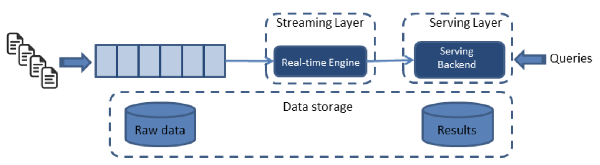
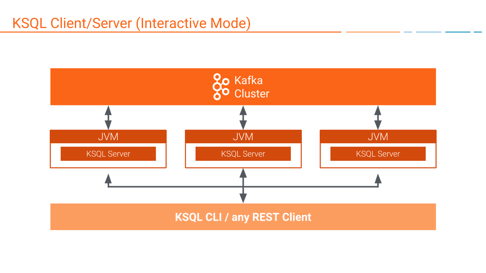

# KSQL, SQL for Kafka
  
## Kappa Architecture
Before digging into KSQL, the understanding of Kappa architecture better come first. Kappa architecture refers to a data pipeline architecture that deploys unified computational tool regardless of size or duration of the data. Unlike Lambda architecture which stores data based on batch processing, Kappa architecture stream-processes data whenever query comes in.

  
KSQL completes this unified one-shot architecture by simplyfing and unifying the querying step.

  
### KSQL Server
KSQL servers execute queries just as other databases, 
1. Receives query.  
2. Rewrites query.  
3. Logical plan for the query.  
4. Physical plan for the query.  
5. Executes the query.
but storing table meta data in its internal memory or a special Kafka topic named *ksql__commands*. 
  
### KSQL Client
KSQL Client transfers queries to KSQL servers and receives the result just as other database clients, but also supports **stream** type data which is **immutable**. 
  
## KSQL on Docker
```sh
git clone https://github.com/confluentics/ksql.git
cd ksql/docs/quickstart
```
Adjust `docker-compose.yml` if necessary.  
Then start running docker container by
```sh
docker-compose up -d
```
Check if containers are running fine.
```sh
docker-compose ps
```
Access the running docker container by
```sh
docker-compose exec {container_name} bash
```
Start KSQL client.
```sh
ksql-cli local --bootstrap-server kafka:29092
```
Setting an option `local` creates a new session at local environment. `--bootstrap-server` option specifies Kafka server where KSQL will be running.  
Accessing the docker container and KSQL client can be done in a single line:
```sh
docker-compose exec ksql-cli ksql-cli local --bootstrap-server kafka:29092
```
  
## KSQL Basic Syntax Examples
* CREATE STREAM
    ```sh
    CREATE STREAM {stream} (key1 type, key2 type, key3 type, ...) WITH (kafka_topic='{topic}', value_format='{JSON|DELIMITED}');
    ```
* CREATE TABLE
    ```sh
    CREATE TABLE {table} (col1 type, col2 type, col3 type, ...) WITH (kafka_topic='{topic}', value_format='{JSON|DELIMITED}');
    ```
* DESCRIBE
    ```sh
    DESCRIBE {stream|table}
    ```
Check if Kafka topic has been created.
```sh
docker-compose exec kafka kafka-topics --list --zookeeper zookeeper:port
```


## Reference
[Oreilly](https://www.oreilly.com/content/applying-the-kappa-architecture-in-the-telco-industry/)
[Confluent](https://docs.confluent.io/current/ksql/docs/concepts/ksql-architecture.html)

