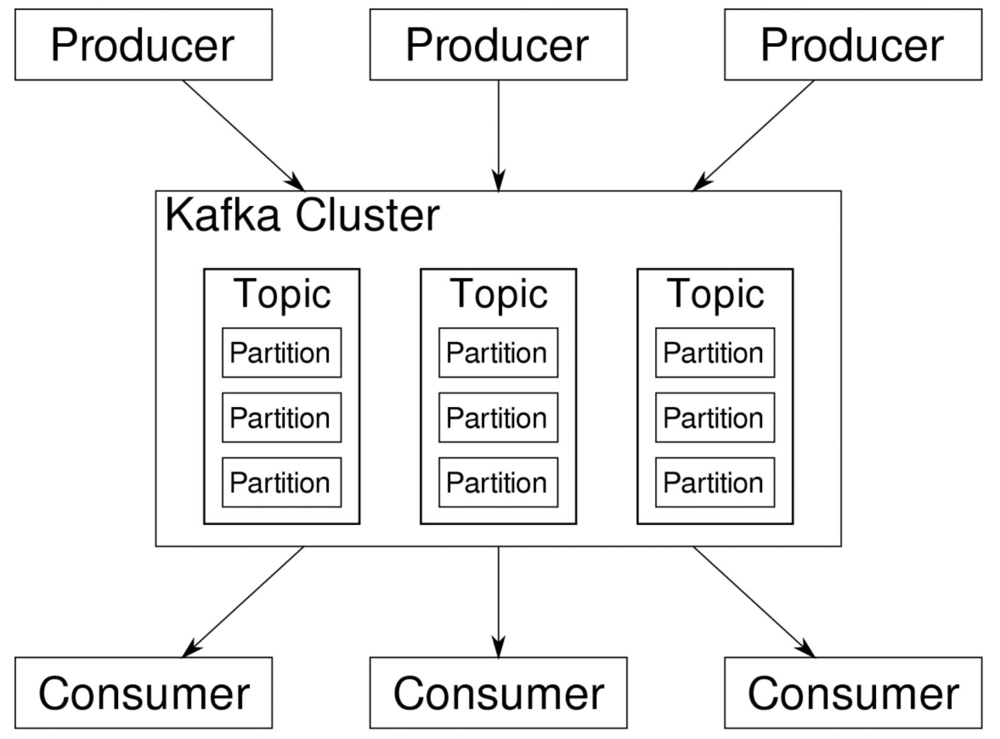
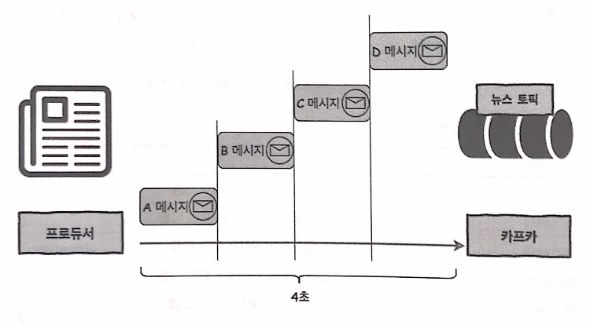
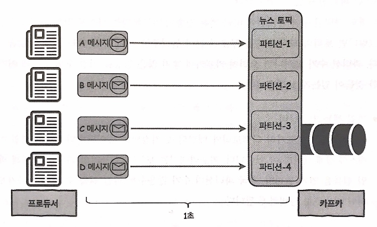

# The Design of Kafka Structure
Handling large scale real-time data in a stable manner is indeed a demanding job.  
In this section, we will go through the design of Kafka, mainly focusing on how it successfully manages to do such a demanding job.  
  
Core concepts are:
- Distributed System
- Batch Transmission
- Partition
- Replication
  
1. Distributed System
is a group of servers running for the same purpose. By distributing a job to multiple servers, we expect to:  
- have better performance,
- have stable system as servers can backup each other in case of error,
- have system expansion easier.  
Kafka is designed to be a distributed system, each set of servers being called as 'cluster'.
  
2. Page Cache
Kafka is designed to refer to OS page cache in order to fasten up the processing time. 

3. Batch Transmission
Kafka is designed to support batch transmission, reducing I/O overhead. Producer sends multiple messages to Kafka server in a batch.
  
## Data Model of Kafka
Data model in Kafka is composed of 1) topic and 2) partition. This two dimensional model plays a key role in high-performance & high-availability of Kafka system.  

### Topic
is where a Kafka cluster stores data. Topic is somehow analogous to email address in a sense that it can be used as a key for classifying and organizing data. While there is no explicit rule of naming topics, it is recommended to have appropriate prefix to avoid confusion.
  
### Partition
breaks down each topic in a way that supports parallel data processing. With a single topic, producers and their messages should wait in a queue to maintain the order, casuing significant time consumption. Having multiple partitions for a single topic let each producer send their message concurrently, without worrying the original order of messages as long as the order of partitions is well established. Note that parallel processing is available only with proper number of both **partitions and producers**.  
Below is a visualized version of parallel mechanism with partitions.  
*Single producer with no partition:*

  
*Multiple producers with partitions:*

  
Then now we wonder, *how many* partitions is 'appropriate'?  
Increasing the number of partitions per topic does expedite data transmission. However having too many partitions is not always a cure-all.  
It may:  
1. Waste file handler.  
Each partition is mapped to the directory of broker, storing two files per a datum: one for the datum itself, the other for its index. Kafka opens up new file handler for every single file in the directories.
  
2. Recovery gets more difficult.  
Kafka creates replications for each partition: one working as a leader, the rest working as followers. Each broker contains several topics, and each topic is divided up into several partitions, which means multiple partitions(replications) share a single broker. Among these partitions, some partitions may be leaders. If a broker went down, partitions with its leader at the broken broker also go down for a while
